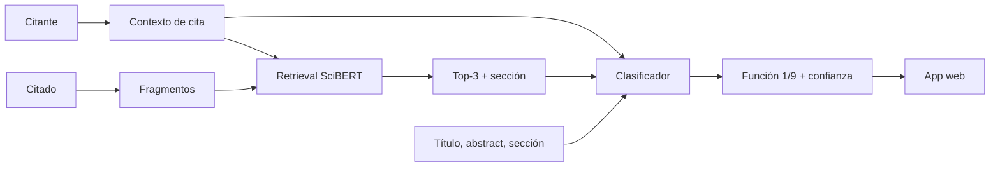

# Título del Proyecto

Recuperación semántica y clasificación de la función de citas académicas en Computer Science.

---

# Integrantes del equipo

Camilo Bejarano, German Rodriguez, Jose Arteaga, Sebastian Toro

---

# Organización y grupo de investigación

- **Organización:** Grupo de investigación FLAG — TICSW, Departamento de Ingeniería de Sistemas y Computación, Universidad de los Andes.
- **Experto de dominio:** PhD. Juan Camilo Sanguino — Machine Learning Engineer and AI Researcher, Departamento de Ingeniería de Sistemas y Computación, Universidad de los Andes.
- **Rol de acompañamiento:** asesoramiento en la definición del problema a resolver, estrategia del proyecto, y resultados esperados; orientación en la bibliografía, validación de las decisiones clave.

---

# Contexto, problema e impacto

## a. Situación actual

La producción científica ha alcanzado una escala en la que su seguimiento manual es inviable: solo arXiv supera los **3,1 millones de artículos** acumulados, con decenas de miles de trabajos nuevos cada mes, y Computer Science es uno de los subdominios de mayor volumen. En este escenario, la cita —el mecanismo con que un artículo se conecta con el conocimiento previo— es el principal instrumento para organizar, evaluar y navegar la literatura.

Sin embargo, la práctica dominante en bibliometría reduce la cita a un **conteo**, tratando por igual una que sienta la base metodológica de un estudio, una que solo lo menciona como lectura complementaria y una que lo critica. Esta homogeneización es una simplificación problemática, pues las prácticas de citación dependen del campo y del propósito del autor, y los conteos no capturan *por qué* se cita. La información que distingue esos matices —la **función retórica** de la cita— está latente en el texto, distribuida en secciones y párrafos específicos del artículo citado.

El Procesamiento del Lenguaje Natural (PLN) aplicado a textos académicos ofrece herramientas para recuperar esa señal mediante dos tareas complementarias: la **recomendación local de citas** (*Local Citation Recommendation*), que alinea un contexto de cita con los fragmentos relevantes del artículo citado, y la **clasificación de la función de la cita** (*Citation Function Classification*), que caracteriza su propósito discursivo. Pese a la abundancia de corpus en inglés, identificar con precisión la función de una cita sigue siendo un reto abierto.

## b. Problema

Hoy no existe una forma automática y confiable de determinar **qué función cumple una cita** dentro de un artículo científico. Este problema es particularmente relevante en el área de Computer Science, que constituye el dominio de estudio de este proyecto. Los enfoques predominantes tratan todas las citas como equivalentes, y la señal que distingue su propósito no está en el marcador de cita, sino dispersa en el cuerpo del artículo citado, lo que hace la tarea ambigua y difícil de automatizar. Este problema general se descompone en tres sub-problemas:

- **Ausencia de datos:** no se dispone de un dataset balanceado y documentado de funciones de cita en Computer Science que permita entrenar y evaluar modelos.
- **Evidencia dispersa en el artículo citado:** dado un contexto de cita, la información que justifica su función se encuentra distribuida en secciones y párrafos específicos del artículo citado, sin estar localizada ni alineada con dicho contexto.
- **Ambigüedad de la clasificación:** una cita puede cumplir más de una función y los contextos suelen ser breves; el proyecto se enfoca en asignar la **función más relevante** (una sola clase), lo que exige criterios consistentes para resolver los casos ambiguos.

## c. Impacto esperado

- **Recurso de datos:** un dataset balanceado y trazable de funciones de cita en Computer Science, con guía de anotación y métricas de acuerdo interanotador, transferible a la comunidad.
- **Evidencia metodológica:** medición cuantificada del aporte de los fragmentos recuperados del artículo citado a la clasificación, comparando un clasificador supervisado y un modelo de lenguaje.
- **Aplicaciones:** apoyo a revisiones sistemáticas de literatura, análisis de impacto bibliométrico cualitativo, verificación de afirmaciones y herramientas de escritura académica asistida.

---

# Objetivos

## Objetivo General

Desarrollar un sistema de PLN que, para un contexto de cita en inglés dentro del área de Computer Science, recupere los fragmentos más relevantes del artículo citado y clasifique la función de la cita en una de nueve categorías —*Background, Gap, Basis, Comparison, Application, Improvement/Modification, Evidence, Identification of the Originator y Further Reading*—, evaluando el aporte de los fragmentos recuperados al desempeño de la clasificación.

## Objetivos Específicos

1. **Obtener un corpus** de artículos de Computer Science desde unarXive, con contextos de cita identificados, artículos citados resolubles y fragmentos segmentados por oración y sección.
2. **Construir un dataset balanceado** de funciones de cita en Computer Science, con al menos 2.000 ejemplos por cada una de las 9 categorías, guía de anotación, etiquetado inicial del conjunto completo mediante modelos de pesos abiertos, validación humana del 15% y acuerdo interanotador.
3. **Implementar la recuperación densa** basada en SciBERT para obtener, por cada contexto de cita, el Top-3 de fragmentos más similares del artículo citado y su sección retórica.
4. **Comparar el desempeño de un clasificador supervisado** basado en SciBERT bajo dos configuraciones de entrada —contexto de cita con el título y el abstract del artículo citado, frente a contexto de cita con la sección retórica y los fragmentos Top-3 recuperados—, y contrastarlo con un modelo de lenguaje comercial de frontera, para determinar si los fragmentos recuperados mejoran la clasificación de la función de cita.
5. **Desplegar una aplicación web** que integre la recuperación del Top-3 y la clasificación de la función de cita, permita seleccionar el clasificador entre un encoder fine-tuned (SciBERT), un modelo open-weight (1–8B) y un modelo comercial vía API, y visualice la función con su confianza.

---

# Estado del arte

El análisis de citas ha migrado del **conteo** hacia la **caracterización semántica** de por qué se cita. Esta sección revisa cuatro frentes —taxonomías de función de cita, conjuntos de datos anotados, métodos de clasificación y recuperación, y el uso emergente de modelos de lenguaje— y contrasta sus límites con la propuesta del grupo.

**Taxonomías de función de cita.** Lyu, Ruan, Xie y Cheng (2021) realizaron una meta-síntesis de 38 estudios y consolidaron 35 conceptos en 13 temas, agrupados en *motivaciones científicas* (retóricas y detectables en el texto) y *motivaciones tácticas* (sociales, no capturables por análisis textual). Su límite es que es un marco conceptual, no un recurso computable: no provee datos etiquetados ni modelos. La propuesta operacionaliza su rama de motivaciones científicas en las **nueve funciones** definidas y construye el dataset que la meta-síntesis no ofrece.

**Conjuntos de datos anotados.** Cohan et al. (2019) introdujeron *SciCite*, un dataset multidominio de intención de cita reducido a **tres clases** (*background, method, result*), insuficientes para el matiz de nueve funciones. Lauscher et al. (2022) propusieron *MultiCite*, aportando dos ideas que este proyecto adopta: los contextos pueden abarcar **varias oraciones** y expresar **varias intenciones a la vez** (multietiqueta); su límite es el dominio estrecho (*computational linguistics*) y la ausencia de vínculo con el texto completo del citado. Frente a ambos, la propuesta cubre las nueve funciones sobre Computer Science y enriquece cada instancia con evidencia recuperada del artículo citado.

**Métodos de clasificación y recuperación.** Beltagy, Lo y Cohan (2019) presentaron *SciBERT*, un modelo preentrenado sobre texto científico que es la base tanto del *retrieval* como de los clasificadores de este proyecto. En recuperación local de citas, Gu et al. (2022) combinaron un codificador jerárquico con un *reranking* basado en SciBERT para recuperar *qué* citar; este proyecto invierte el problema: dado un par citante–citado, recupera los fragmentos del citado que **explican** la cita para clasificar su función. Estos métodos supervisados dependen de datos etiquetados costosos, lo que aquí se mitiga con pre-etiquetado asistido y validación humana.

**Modelos de lenguaje y corpus.** El corpus *unarXive 2022* (Saier, Krause y Färber, 2023) provee texto completo estructurado de arXiv con la red de citas resuelta, y es la fuente base del proyecto. Los modelos de lenguaje de frontera permiten clasificar la intención de cita sin reentrenamiento; el proyecto los usa como jueces para el pre-etiquetado y como línea de comparación en inferencia.

---

# Metodología y enfoque propuesto

## Enfoque técnico

La solución es un pipeline de dos componentes encadenados sobre artículos en Computer Science:

1. **Recuperación semántica (retrieval):** el artículo citado se segmenta en fragmentos (*chunks*) de ≤300 palabras o ≤2 párrafos, respetando límites de oración y sección, y, mediante *embeddings* de **SciBERT** y similitud coseno, se recuperan los **Top-3** fragmentos más cercanos a cada contexto de cita, conservando su sección retórica de origen.
2. **Clasificación de la función de cita:** modelos que asignan una de las **9 funciones**. Se evalúa un clasificador supervisado basado en **SciBERT**, ajustado mediante *fine-tuning* con una cabeza de clasificación y pérdida de entropía cruzada, bajo dos configuraciones de entrada: (a) contexto de cita con el título y el abstract del artículo citado y (b) contexto de cita con la sección retórica y los fragmentos Top-3 recuperados. Como comparación adicional, se evalúa un modelo comercial de lenguaje de frontera sobre la información del artículo citado.

**Justificación:** SciBERT está preentrenado sobre texto científico en inglés, lo que se ajusta al dominio; comparar una entrada con solo el título y el abstract frente a otra que incorpora la sección retórica y los fragmentos recuperados permite medir directamente el aporte de la recuperación densa, insumo central de la pregunta de investigación; y contrastar el clasificador supervisado frente a un modelo de lenguaje comercial ofrece una línea de comparación adicional.

## Fases del Proyecto

El desarrollo es incremental y cada fase produce artefactos versionados y reutilizables:

- **F1 — Extracción, segmentación y recuperación de fragmentos.** Procesar arXiv (unarXive) para obtener texto plano en inglés, identificar marcadores y contextos de cita, segmentar el artículo citado en fragmentos y asociar con SciBERT los 3 fragmentos más similares por contexto de cita, con su sección de origen. 
- **F2 — Etiquetado asistido (sistema de jueces).** Modelos open-weight (Qwen3.5 9B, Gemma 4 E4B, Ministral 3 8B) asignan una única función de cita a cada registro del conjunto completo. Un esquema de varios jueces contrasta sus respuestas y produce una etiqueta inicial para apoyar la conformación del dataset.
- **F3 — Construcción del dataset y validación humana.** Estructurar el dataset balanceado (2.000 por clase) a partir del etiquetado inicial, validar manualmente una muestra del 15% seleccionada por categoría, corregir las etiquetas cuando sea necesario, reportar acuerdo interanotador (Kappa/Alpha) y dividir en train/validation/test con aislamiento estricto por documento.
- **F4 — Clasificador supervisado (fine-tuning).** Ajustar un único modelo base (SciBERT) probando dos configuraciones de entrada: (a) el título y el abstract del artículo citado y (b) la sección retórica y los fragmentos Top-3 recuperados. En ambas, la entrada concatena el contexto de cita con la información del artículo citado mediante un token especial de separación, con una cabeza de clasificación sobre las 9 categorías y pérdida de entropía cruzada.
- **F5 — Evaluación con un modelo de lenguaje.** Evaluar un único modelo comercial de lenguaje de frontera (por ejemplo, GPT-4o) en inferencia sobre la información del artículo citado, comparando dos estrategias de *prompting* (*zero-shot* y *few-shot*). El modelo entregará un puntaje entre 0.0 y 1.0 por cada una de las 9 categorías para facilitar el parseo automático, estableciendo una línea de comparación frente al clasificador supervisado.
- **F6 — Evaluación comparativa.** Comparar el clasificador supervisado y el modelo de lenguaje sobre el test validado por humanos con Precision, Recall y F1 (macro y micro), además de matrices de confusión para identificar funciones ambiguas.
- **F7 — Despliegue.** Aplicación web que integra el flujo completo: ingreso de un contexto de cita, recuperación y visualización del Top-3 con su sección, selección del clasificador entre tres opciones —encoder fine-tuned (SciBERT), modelo open-weight (1–8B) y modelo comercial vía API— y presentación de la función predicha con su confianza.

## Plan de validación

La validación cubre tres niveles: (i) **dataset**, con acuerdo interanotador sobre el 15% validado por humanos, comparación entre las etiquetas iniciales de los modelos y las etiquetas humanas, y verificación de balance de clases y no-*leakage*; (ii) **recuperación**, con *precision@3* sobre una muestra anotada por el equipo. Un fragmento se considera relevante cuando contiene evidencia directamente relacionada con la función de la cita; dos anotadores evaluarán los fragmentos recuperados y reportarán su acuerdo, además de la proporción de fragmentos relevantes en el Top-3; y (iii) **clasificación** (experimento central): SciBERT bajo dos configuraciones de entrada —título y abstract, frente a sección retórica y fragmentos Top-3—, y un modelo comercial de lenguaje de frontera con estrategias *zero-shot* y *few-shot* sobre la información del artículo citado.

### Arquitectura del pipeline

La arquitectura del pipeline se resume en el siguiente diagrama:

El detalle de herramientas se presenta en el **Apéndice**.

---

# Exploración y descripción de los datos

## Características de los datos

- **Fuente principal:** **unarXive 2022**, corpus generado desde fuentes LaTeX de arXiv. Cada artículo (JSONL) trae `paper_id`, `metadata`, `abstract`, `body_text` (párrafos con `section`, `sec_type`, `cite_spans`, `ref_spans`), `bib_entries` y `ref_entries`. Dominio Computer Science: ~320.000 artículos y del orden de ~2,5 M de eventos de citación.
- **Vínculo de citas:** cada marcador de `cite_spans` se enlaza por `ref_id` con `bib_entries`, que ya aporta la referencia cruda del citado (`bib_entry_raw`, con su título) y sus identificadores resueltos (`open_alex_id`, `doi`, IDs de arXiv). No requiere enriquecimiento externo para el título ni para identificar el citado.
- **Metadatos y texto del citado:** cuando el artículo citado también pertenece al corpus, su título, abstract y texto completo se obtienen directamente de unarXive por su `paper_id`. Para los citados fuera del corpus, el abstract se completa como *fallback* vía OpenAlex (`abstract_inverted_index`) y el texto completo solo está disponible si es recuperable desde arXiv; la recuperación Top-3 exige dicho texto completo.
- **Unidad (registro):** contexto de cita + artículo citante + artículo citado + Top-3 fragmentos recuperados + etiqueta de función de cita.
- **Sin etiquetas de función:** unarXive no trae la función de cita; debe generarse por anotación asistida + validación humana.
- **Licencia:** subconjunto abierto CC BY-SA 4.0; versión completa restringida por documento. No hay datos personales sensibles (literatura pública), pero debe respetarse la licencia para redistribución.

### Desafíos y limitaciones
- **Desbalance de clases:** funciones como *Gap*, *Identification of the Originator* o *Further Reading* son minoritarias.
- **Solapamiento entre funciones:** una cita puede cumplir más de una función; el proyecto adopta un enfoque **multiclase de etiqueta única**, asignando la función más relevante.
- **Disponibilidad del citado:** sin texto completo no hay recuperación Top-3.
- **Ruido de parsing LaTeX** y referencias no resolubles.
- **Fuga de información:** contextos que comparten citante/citado deben ir en la misma partición.

## Estrategia de construcción del dataset

Meta: **9 × 2.000 = 18.000 registros** balanceados. Se parte de ~2,5 M de eventos y se reduce de forma controlada; cada etapa produce un artefacto versionado y registra las razones de descarte.

| Etapa | Acción | Artefacto |
|---|---|---|
| 1 | Filtro técnico: Computer Science (`discipline`), inglés, `cite_spans` con `ref_id` válido, contexto no vacío | `technical_filtered.jsonl` |
| 2 | Construcción del contexto de cita desde `body_text` (párrafo/ventana) | `contexts.jsonl` |
| 3 | Resolución del citado por `bib_entries.ids` (arXiv/OpenAlex) y verificación de texto completo | `resolved_references.jsonl` |
| 4 | Fragmentos + recuperación Top-3 (SciBERT) | `retrieved_chunks.jsonl` |
| 5 | Pre-etiquetado asistido (sistema de jueces LLM) | `model_annotations.jsonl` |
| 6 | Selección de candidatos (~27.000 + reserva) | `candidate_pool.jsonl` |
| 7 | Validación humana (15% = test) + acuerdo interanotador | `final_dataset.jsonl` |

Principios transversales: reducción con registro de motivos, excedente controlado, balance diferido sobre etiquetas verificadas, sin duplicación artificial de contextos y no fuga de información (partición por documento).

---

# Consideraciones éticas

## Impacto social y ético
La solución apoya la revisión y comprensión de literatura científica. Un mal uso podría distorsionar análisis bibliométricos o revisiones. Se comunicará el carácter asistivo de la herramienta y sus límites de confianza.

## Sesgos y su mitigación
- **Sesgo de dominio:** el corpus es Computer Science en inglés; los resultados no generalizan a otras disciplinas ni idiomas.
- **Sesgo de sección:** los contextos se concentran en *Introduction* y *Related Work*; se aplicará muestreo distribuido por sección.
- **Sesgo del pre-etiquetado:** depender solo de la confianza del LLM puede perder clases minoritarias; se mitiga con jueces múltiples, validación humana y balance diferido.
- **Desbalance de clases:** búsqueda dirigida y muestreo estratificado para clases minoritarias.

## Transparencia y explicabilidad
La aplicación mostrará los Top-3 fragmentos recuperados y su sección, además de la confianza por categoría, para que el usuario entienda en qué evidencia se apoya la predicción. Se documentarán modelos, prompts, semillas y métricas.

## Privacidad y seguridad
Se trabaja con literatura pública; no hay datos personales sensibles. Se respetarán las licencias para conservar y redistribuir texto. Las claves de API y credenciales de infraestructura se manejan fuera del control de versiones.

---

# Evaluación y métricas

- **Clasificación de función de cita:** Precision, Recall y **F1 macro y micro** sobre el test validado por humanos (15%); matrices de confusión para identificar funciones ambiguas.
- **Configuraciones de entrada y comparación:** se compara SciBERT con el título y el abstract del artículo citado frente a SciBERT con la sección retórica y los fragmentos Top-3 recuperados. El éxito se define como una mejora consistente del **F1 macro** de la configuración con fragmentos recuperados sobre la de solo título y abstract, y un desempeño claramente superior a la línea de azar (1/9 ≈ 11,1% en 9 clases balanceadas); la meta cuantitativa concreta se afinará con el experto según la dificultad observada.
- **Comparación de modelos:** la mejor configuración de SciBERT se compara con un modelo comercial de lenguaje de frontera (*zero-shot* y *few-shot*), utilizando la misma información del artículo citado y métricas cuando sea técnicamente posible.
- **Calidad de la anotación:** acuerdo interanotador (Cohen/Fleiss Kappa o Krippendorff Alpha).
- **Recuperación (retrieval):** al no existir *ground-truth* de relevancia, se evalúa mediante *precision@3* sobre una muestra anotada por el equipo y la coherencia de la sección retórica de los fragmentos recuperados; su utilidad final se refleja en el desempeño de clasificación que alimenta.
- **Eficiencia:** costo de fine-tuning frente al costo por tokens del modelo de lenguaje, latencia por inferencia y tasa de errores de formato/parseo (F7).

**Experiencia previa del equipo:** en el microproyecto CiteScope, sobre clasificación de funciones de cita en la subárea `cs.*`, SciBERT Plus alcanzó un Macro F1 de 0,68 en el conjunto de prueba. Este resultado constituye un antecedente técnico para el uso de modelos científicos en el proyecto actual.

---

# Bibliografía

- Beltagy, I., Lo, K., & Cohan, A. (2019). SciBERT: A pretrained language model for scientific text. *Proceedings of EMNLP-IJCNLP 2019*, 3615–3620.
- Cohan, A., Ammar, W., van Zuylen, M., & Cady, F. (2019). Structural scaffolds for citation intent classification in scientific publications. *Proceedings of NAACL-HLT 2019*, 3586–3596.
- Gu, N., Gao, Y., & Hahnloser, R. H. R. (2022). Local citation recommendation with hierarchical-attention text encoder and SciBERT-based reranking. *Advances in Information Retrieval (ECIR 2022)*, LNCS 13185, 274–288.
- Lauscher, A., Ko, B., Kuehl, B., Johnson, S., Cohan, A., Jurgens, D., & Lo, K. (2022). MultiCite: Modeling realistic citations requires moving beyond the single-sentence single-label setting. *Proceedings of NAACL-HLT 2022*, 1875–1889.
- Lyu, D., Ruan, X., Xie, J., & Cheng, Y. (2021). The classification of citing motivations: A meta-synthesis. *Scientometrics, 126*(4), 3243–3264. https://doi.org/10.1007/s11192-021-03908-z
- Saier, T., Krause, J., & Färber, M. (2023). unarXive 2022: All arXiv publications pre-processed for NLP, including structured full-text and citation network. *Proceedings of JCDL 2023*.
- Bjerke, M. B., & Renger, R. (2017). Being smart about writing SMART objectives. *Evaluation and Program Planning, 61*, 125–127. https://doi.org/10.1016/j.evalprogplan.2016.12.009
- Centro de Español, Universidad de los Andes. (s. f.). *¿Cómo plantear objetivos?* https://leo.uniandes.edu.co/como-plantear-objetivos/
- OpenAlex. https://openalex.org/

---

# Apéndices

## Apéndice — Herramientas

- **Datos / corpus:** unarXive 2022, OpenAlex, arXiv; Python (pandas, NumPy).
- **Recuperación y modelado:** PyTorch, Hugging Face Transformers (SciBERT `allenai/scibert_scivocab_uncased`); similitud coseno (FAISS opcional) para la recuperación.
- **Modelos de lenguaje:** un modelo comercial de lenguaje de frontera vía API (evaluado con *zero-shot* y *few-shot*) y un modelo open-weight (1–8B) disponible en el demostrador.
- **Evaluación:** scikit-learn (Precision, Recall, F1, matrices de confusión) y métricas de acuerdo interanotador (Cohen/Fleiss Kappa, Krippendorff Alpha).
- **MLOps:** Git, DVC (remoto S3), MLflow (servidor en EC2), FastAPI, PostgreSQL, Docker.
- **Aplicación web:** Next.js / React / TypeScript, integrada con las tres opciones de clasificación del demostrador.

